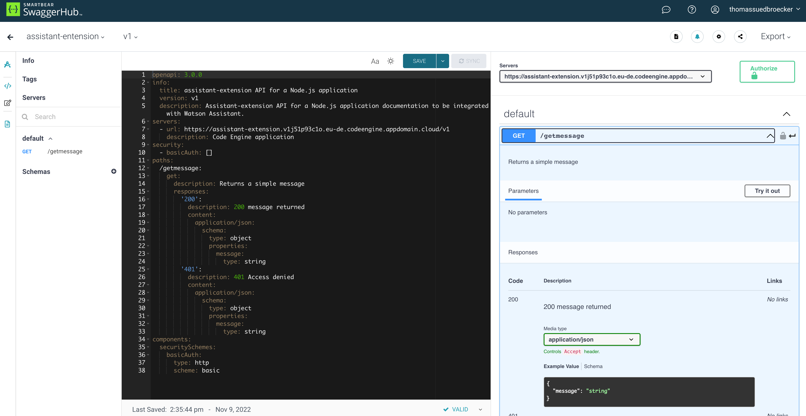

# Create OpenAPI/swagger 3.0.0 documentation

On [SwaggerHub](https://app.swaggerhub.com/home) you can verify your Swagger or OpenAPI documentation created manually or by an automation.



### 1. OpenAPI Specification 

This is the documentation which was created manually.
Just get a bit familiar with the documentation.

* YAML

```yaml
openapi: 3.0.0
info:
  version: v1
  title: assistant-extension API for a Node.js application
  description: Assistant-extension API for a Node.js application documentation to be integrated with Watson Assistant.

servers:
  - description: Code Engine application
    url: https://YOUR_APPLICATION_URL/v1

security:
  - basicAuth: []
  
paths:
  /getmessage:
    get:
      description: Returns a simple message
      responses:
        '200':
          description: 200 message returned
          content:
            application/json:
              schema:
                type: object
                properties:
                  message:
                    type: string
        '401':
          description: 401 Access denied
          content:
            application/json:
              schema:
                type: object
                properties:
                  message:
                    type: string
components:
  securitySchemes:
    basicAuth:
      type: http
      scheme: basic
```

* JSON

```json
{
  "openapi": "3.0.0",
  "info": {
    "title": "assistant-extension API for a Node.js application",
    "version": "v1",
    "description": "Assistant-extension API for a Node.js application documentation to be integrated with Watson Assistant."
  },
  "servers": [
    {
      "url": "https://YOUR_APPLICATION_URL/v1",
      "description": "Code Engine application"
    }
  ],
  "security": [
     {"basicAuth":[]}
  ],
  "paths": {
    "/getmessage": {
      "get": {
        "description": "Returns a simple message",
        "responses": {
          "200": {
            "description": "200 message returned",
            "content": {
              "application/json": {
                "schema": {
                  "type": "object",
                  "properties": {
                    "message": {
                      "type": "string"
                    }
                  }
                }
              }
            }
          },
          "401": {
            "description": "401 Access denied",
            "content": {
              "application/json": {
                "schema": {
                  "type": "object",
                  "properties": {
                    "message": {
                      "type": "string"
                    }
                  }
                }
              }
            }
          }
        }
      }
    }
  },
  "components": {
    "securitySchemes": {
      "basicAuth" : {
        "type": "http",
        "scheme": "basic"
      }
    }
  }
}
```


### 2. Links to useful resources

* [SwaggerHub](https://app.swaggerhub.com/home) Here you can verify your Swagger or OpenAPI documentation.
* [OpenAPI Tools](https://github.com/OpenAPITools/openapi-generator#table-of-contents) "OpenAPI Generator allows generation of API client libraries (SDK generation), server stubs, documentation and configuration automatically given an [OpenAPI Spec](https://github.com/OAI/OpenAPI-Specification) (both 2.0 and 3.0 are supported)."
* [Smartbear SwaggerHub tutorials](https://support.smartbear.com/swaggerhub/docs/tutorials/openapi-3-tutorial.html)

